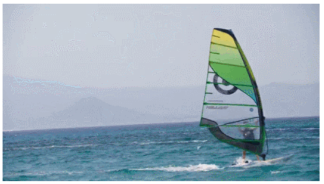
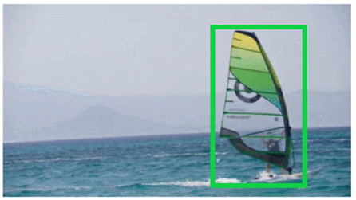
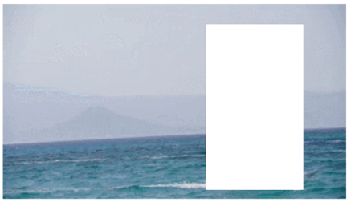
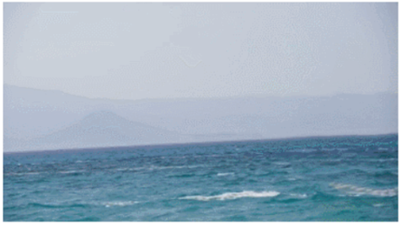

# 对视频中选定对象的消除
## 项目的组成
### 1、Visual Tracking
#### 目标追踪关注的问题是如何在视频序列的每幅图像中找到感兴趣的目标位置。需要跟踪的目标是通过起始帧的选择框给出的，我们希望能在后续的视频中追踪这个目标，而该目标在过程中可能会发生变形、光照变化、模糊、相似背景干扰等问题，这些都让追踪目标十分困难。
### 2、Image inpainting
#### 图像修补的目的是修复被各种类型内容影响的失真，其中包括状遮挡、文本遮挡、噪声、目标遮挡、图像掩膜、照片划痕等。图像修补的结果需要维持原图整体的和谐统一。
## 期望效果

## 第一部分：Visual Tracking
选择基于 Cascade R-CNN 实现的 Siam R-CNN 算法进行目标追踪。
### 尝试进行的优化
#### 思路一 完善相似度计算方式，优化追踪效果
原算法：将每一帧boxes备选框与第一帧的ground_truth计算相似度来识别，到最后产生多个备选序列。
问题：事物在整个过程中自身不断变化、位置不断改变，因此每一帧均与第一帧做相似度对比不一定能够产生最佳效果。
针对以上问题计划尝试的优化方案：
  不是每次都与第一帧，而是与当前帧前某一帧的 gt 进行相似度计算并识别候选框。
  结合第一帧与当前帧的前几帧的一起判断，即额外结合当前帧与前一帧或前几帧的相似度计算，与原相似度结合并比较。
##### 尝试1：与当前帧前某一帧的 gt 进行相似度计算并识别候选框
实现思路：在预测时设置一个迭代时间周期t，每t次迭代更新为新的groundtruth，即每隔t帧后，将用于计算相似度的ground_truth更换成当前帧的图像特征值。
效果没有改善反而下降。认为原因在于box序列越长，序列之间的差别越大，若截断序列则会导致各备选序列均较为相似，不易从中选择和判断label。
##### 尝试2：结合第一帧与多帧的一起判断相似度并比较。
实现思路：不仅仅根据第1帧的ground truth对第t帧的目标物体进行追踪，而是结合了之前t/2等帧的追踪结果综合判断，以应对目标物体在视频中形态发生较大改变的特殊情况，增强了模型的鲁棒性
效果有明显改善。
#### 思路二 数据预处理以期望提高准确率
检查发现数据集中图片像素过低，在相似度计算和边框回归计算时误差会较大，影响最终的追踪准确率和成功率
对数据集中所有图片输入前进行图像超分预处理，这里使用的是基于tensorflow实现的 LapSRN 网络模型。
对所有图片数据的ground_truth进行等比例放缩，比例与图像超分设置的比例一致。
## 第二部分：Image inpainting
基础模型-GMCNN。
主要思想：
1、生成多列的CNN结构，不同大小的卷积核提取不同内容
2、对抗训练有全局和局部两个鉴别器
### 存在问题
生成效果高度依赖训练时定义的mask形状和大小。
当mask的形状变化时，生成结果很差。
无法适应视频中物体运动时大小形状会变化的需求
### 优化思路
使用gated convolution在训练网络时将mask的形状也作为信息可以学习（代价是参数多了一倍）
## 综合效果

